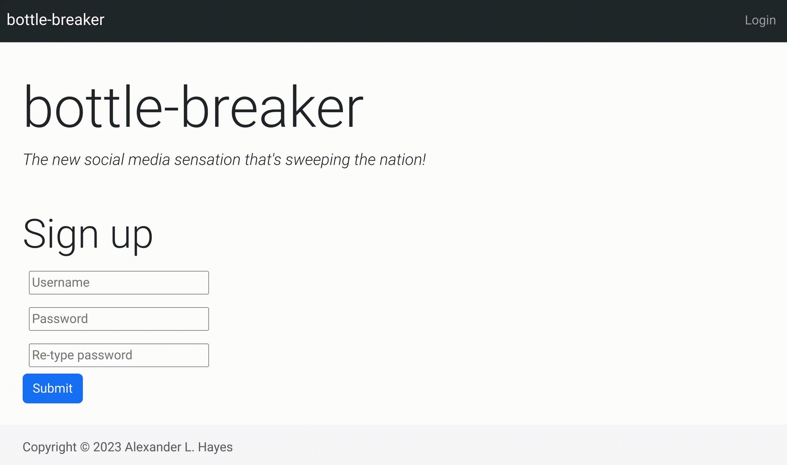

# bottle-breaker 🍼💥

*A small flask application to demonstrate potential security vulnerabilities that may come up when writing web applications. i.e.: cross-site scripting (XSS) vulnerabilities and SQL injection attacks.*



## Setup and run

### 1. Clone the repository

**VSCode**: New Window > Clone Git Repository

```bash
https://github.com/hayesall/bottle-breaker.git
```

**Terminal**

```bash
git clone https://github.com/hayesall/bottle-breaker.git
cd bottle-breaker
```

---

### 2. Create a virtual environment and install dependencies

**Linux / Chromebook**

```bash
python -m venv venv
source venv/bin/activate
pip install -r requirements.txt
```

**MacOS**

```bash
python3 -m venv venv
source venv/bin/activate
pip install -r requirements.txt
```

**Windows + PowerShell** (or see [venv docs for your platform](https://docs.python.org/3/library/venv.html#how-venvs-work))

```powershell
python -m venv venv
.\venv\Scripts\Activate.ps1

# Windows seems to take issue with the 'requirements.txt' file, try this:
pip install Flask==2.2.3 Flask-Login==0.6.2 Flask-WTF==1.1.1 WTForms==3.0.1
```

## Scavenger Hunt

### 1. Make a post as a *different* user


<details>
<summary><strong>Problem 1 Hints</strong></summary>

<details>
<summary>Hint #1</summary>

The post form on the home page is vulnerable. View page source, read how the `POST` method works, and see if you can make a post as a different user.

</details>

<details>
<summary>Hint #2</summary>

The page inspector or developer tools (in Firefox, Chrome, Opera, etc.) can be accessed by clicking on an element and selecting "Inspect", or with the shortcut <kbd>CTRL</kbd> + <kbd>SHIFT</kbd> + <kbd>I</kbd> / <kbd>⌘</kbd> + <kbd>OPTION</kbd> + <kbd>I</kbd>.

If you modify something on the page and click <kbd>ENTER</kbd>, the document object model displayed by your browser is updated. This includes all form elements.

</details>


<details>
<summary>Hint #3</summary>

The form on the home page lists something like: `action="/make-post@author=hayesall"`

</details>

<details>
<summary>Solution</summary>

Change the name of the user in the developer tools to something like: `action="/make-post@author=alice"`, and click enter. When you make a post, the post is inserted into the database as `alice` instead of your username.

This form is vulnerable because it inserts the name of the logged-in user into the form, but does not validate that the user making the `POST` request is the same as the user who clicks the button.

</details>


</details>

---

### 2. Trigger JavaScript to execute when users view a post

<details>
<summary><strong>Problem 2 Hints</strong></summary>

<details>
<summary>Hint #1</summary>

The form on the home page allows users to style their posts with basic HTML formatting. For example, users can post something like:

```html
<strong>Hello</strong> <em>World!</em>
```

... in order to style their posts with bold or italic formatting.

</details>

<details>
<summary>Hint #2</summary>

The `index.html` template includes something that says: `{{ post.content | safe }}`.

Normally, we should only use the `safe` filter on content that we have verified is safe.

</details>


<details>
<summary>Solution</summary>

The way we display posts includes a **cross-site scripting** (XSS) vulnerability. Users can post something like:

```html
<script>alert('samy is my hero');</script>
```

When users view this post, the JavaScript gets executed, triggering an "Alert" message in their browser.

</details>


</details>

---

### 3. Delete a post made by another user

You can do this without SQL injection.

<details>
<summary><strong>Problem 3 Hints</strong></summary>

<details>
<summary>Hint #1</summary>

The `delete_post` method in `app.py` is vulnerable. Go to your profile, view page source, and figure out how the form submission works.

</details>

<details>
<summary>Hint #2</summary>

This is similar to the solution for the first problem.

</details>

<details>
<summary>Hint #3</summary>

`user_profile.html` inserts "Delete" buttons with the following code:

```html

<form action="{{ url_for('delete_post', username=username, post_id=post.id) }}" method="POST">
    <button type="submit" class="btn btn-danger rounded-0">X</button>
</form>

```

</details>


<details>
<summary>Solution</summary>

Similar to the first problem, the backend uses an API that does not verify who is making a request to an endpoint. Furthermore, it does not even check whether the post number belongs to the user 😬

The `user_profile.html` template conditionally inserts delete buttons *only* when the logged in user is the same as the user viewing the page, but there is nothing stopping *anyone* from triggering the API on form submission.

Change the form action to something like:

```
/delete-post/hayesall/1
```

... and click the red submit button.

</details>


</details>

---

### 4. Use an SQL injection attack to drop the `posts` table

<details>
<summary><strong>Problem 4 Hints</strong></summary>

<details>
<summary>Hint #1</summary>

In SQL, `--` is a comment, meaning that everything after `--` is ignored by the parser.

```sql
DROP TABLE posts; -- This is a comment, everything after the double-dash is ignored
```

</details>

<details>
<summary>Hint #2</summary>

The architecture of an SQL injection attack is to write a query that is (1) valid SQL and passes the server's input validation and the database's query parser, but (2) does something unexpected.

For example, if we have a query that normally inserts a name into a table:

```sql
INSERT INTO users (username) VALUES ('alice');
```

... consider what would happen if `alice` was replaced with `alice'); DROP TABLE posts; -- `. The resulting query would be:

```sql
INSERT INTO users (username) VALUES ('alice'); DROP TABLE posts; -- ');
```

</details>


<details>
<summary>Hint #3</summary>

This site uses SQLite, which is normally built around the `sql.execute()` method. This takes a string as input and executes it as a query.

This method has some built-in security. For example: if you try to execute a query that contains a semicolon (i.e., multiple statements), it will fail with something like:

```python
sqlite3.Warning: You can only execute one statement at a time.
```

If you have a local copy of the code, try finding *which line might be vulnerable* by grepping for a line of code that contains a non-standard execute call:

```bash
git grep -n 'self.curr.execute'
```

`git grep -n` returns the file and line number for each match.

</details>


<details>
<summary>Solution</summary>

Hints 1/2/3 should lead you toward the `/settings` page and "Change Username" form. The form is vulnerable to SQL injection because the `change_username` methods uses a dangerous pattern:

```python
script = f"PRAGMA foreign_keys = ON; UPDATE users SET username = '{new_username}' WHERE username = '{old_username}';"
self.curr.executescript(script)
```

This is vulnerable because the `executescript` method allows multiple statements to be executed at once, and the code uses literal string interpolation (f-strings) to build up a command. If we can insert a semicolon into the `new_username` field and use our knowledge of our `old_username`, we can write a query that drops the `posts` table:

```
alice2' WHERE username = 'alice'; DROP TABLE posts; --
```

</details>


</details>

---

## Legal Points

### Disclaimer

This project is for educational purposes only. Understanding how exploits work is important, but you should not use this information to attack websites without the owner's consent. I am not responsible for damage you cause, and this knowledge should be applied toward preventing attacks, not launching them.

I live in the United States, and I am not a lawyer. For others in the United States, computer "hacking" is broadly defined and possibly punishable under the terms specified in the *Computer Fraud and Abuse Act* and related policy. Your local jurisdiction may have different terms, depending on the state or country where you reside.

**Related readings for people in the United States**:

- https://www.justice.gov/jm/jm-9-48000-computer-fraud
- https://www.law.cornell.edu/uscode/text/18/1030

### License

This project is available under the terms of the MIT License or Apache 2.0 License, at your choosing. See the `LICENSE-MIT` or `LICENSE-APACHE` files for more information.
